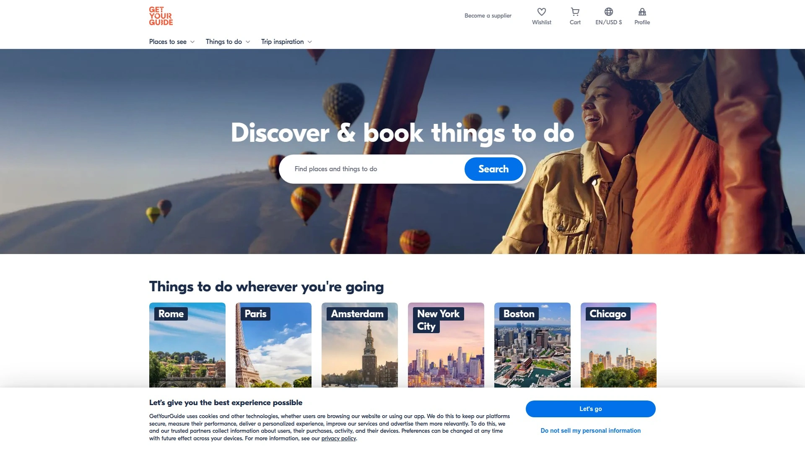
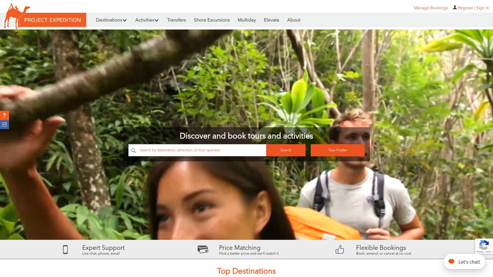
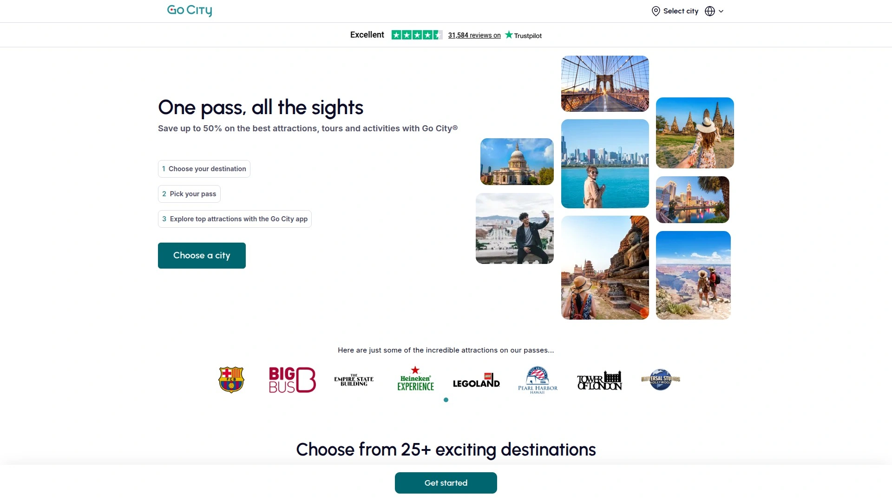
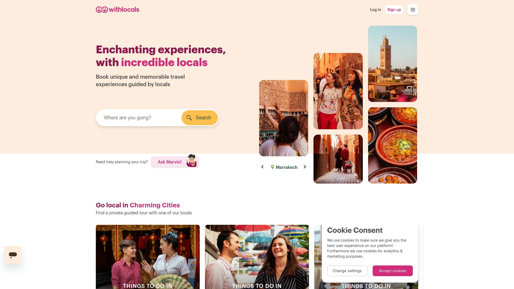
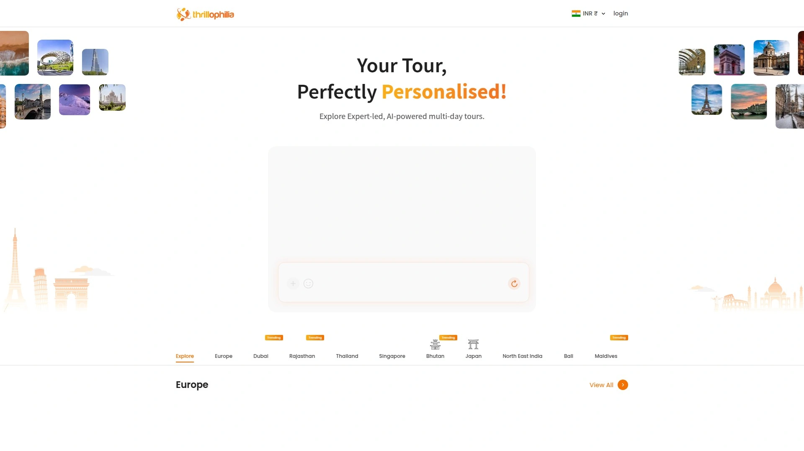
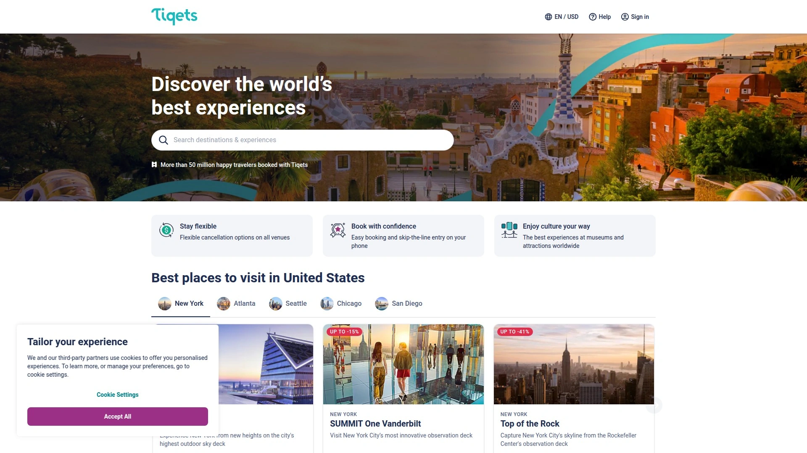
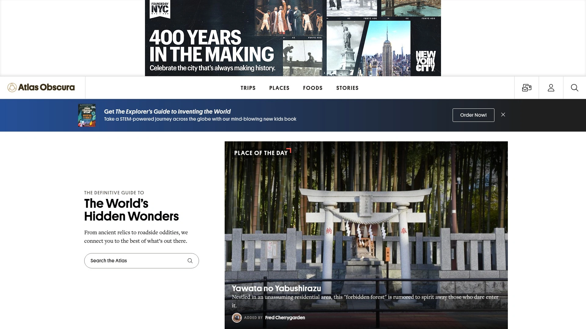

# 10 Best Tour & Activity Booking Platforms in 2025

You've booked the flight and the hotel, but now comes the really fun part: figuring out what you'll actually *do*. Sifting through countless blogs to find reliable travel activities and book tours can feel like a job in itself. We've simplified the process by curating the best platforms for booking excursions, so you can spend less time planning and more time enjoying your trip.

## **[Viator](https://viator.com)**

As a TripAdvisor company, Viator offers a massive inventory of over 300,000 experiences, making it a go-to for tours and activities, especially in Europe and North America.

Leveraging millions of traveler reviews, this platform helps you book with confidence, whether you need skip-the-line tickets for a major museum or a full-day sightseeing tour. Its listings are known for being rich with photos and providing detailed information about what to expect, accessibility, and meeting points. The platform also features a generous 24-hour cancellation policy for most bookings, adding a layer of flexibility to your plans.

## **[GetYourGuide](https://getyourguide.com)**

GetYourGuide is a user-friendly platform that excels at offering curated, high-quality experiences across more than 150 countries.

This site is great for discovering unique things to do, from cultural tours to culinary adventures. It stands out with its "GetYourGuide Originals"—exclusive tours that promise smaller groups and special access you won't find elsewhere. With a strong emphasis on customer reviews and a simple booking process, it's a favorite for travelers looking for both popular attractions and hidden gems.

## **[Klook](https://klook.com)**

Originally a powerhouse for Asia-based travel, Klook has expanded globally and is known for its wide range of affordable tours and activities.

If you're looking to book theme park tickets, transportation passes, and local experiences all in one place, Klook is an excellent choice. It’s particularly strong in Asian destinations but now offers services worldwide. The platform is celebrated for its competitive pricing and easy-to-use mobile app that simplifies booking on the go.

## **[Project Expedition](https://projectexpedition.com)**

Project Expedition provides a curated marketplace of over 20,000 experiences and is unique for its transparency in showing the name of the local tour operator for each listing.

This platform is ideal for travelers who want to know exactly which company is running their tour. It offers a diverse inventory that includes everything from shore excursions and multi-day adventures to airport transfers. With detailed filtering options and carefully vetted tour operators, it makes it easy to find high-quality experiences in over 800 cities.

## **[Tripadvisor](https://tripadvisor.com)**

While famous for its extensive library of over a billion user reviews, Tripadvisor is also a robust platform for booking hotels and activities directly.

It serves as a massive search engine for things to do, allowing you to read what other travelers thought before you commit. While its main focus for direct booking rewards is on hotels, it’s an invaluable tool for researching and comparing a vast range of tours and attractions worldwide.

## **[GoCity](https://gocity.com)**

GoCity is the perfect choice for travelers planning to visit multiple attractions within a single city, offering passes that can lead to significant savings.

Available in over 25 major cities like Paris, New York, and Rome, a GoCity pass gives you access to a bundle of top museums, tours, and cruises for one price. This approach simplifies sightseeing by letting you visit numerous spots without buying individual tickets for each, making it ideal for action-packed city breaks.

## **[WithLocals](https://withlocals.com)**

If you're seeking authentic and personalized experiences, WithLocals connects you directly with local hosts for private tours.

This platform is fantastic for travelers wanting to get away from large tour groups and see a destination through the eyes of someone who lives there. It's particularly strong in Europe and Asia and is a great option for finding unique activities, from home-cooked meals to private walking tours, hosted by residents.

## **[Thrillophilia](https://thrillophilia.com)**

Thrillophilia is an award-winning platform that offers a massive variety of tours, activities, and rentals across numerous categories.

With a user-friendly mobile app, you can book and manage your experiences easily while on the move. The platform is well-regarded by both its users and the operators who list their services on it. It’s a great all-around choice for finding everything from day tours to adventure activities.

## **[Tiqets](https://tiqets.com)**

Tiqets specializes in making culture more accessible by providing a simple way to book last-minute mobile tickets to museums, shows, and attractions worldwide.

The platform is designed for spontaneous travelers who might decide to visit an attraction on the day of. It focuses on instant, paperless ticketing sent directly to your phone, allowing you to skip the line at popular venues. It’s a lifesaver when you want to make the most of your time in a new city.

## **[Atlas Obscura](https://atlasobscura.com)**

For the traveler who wants to explore the world's hidden wonders and unusual places, Atlas Obscura offers unique trips and experiences that you won't find anywhere else.

This platform is built around a community of explorers and focuses on offbeat and extraordinary destinations. If you're tired of the usual tourist trails and want to embark on an adventure that's truly one-of-a-kind, from exploring strange museums to taking unique guided tours, this is the site for you.

### FAQ

**How far in advance should I book tours?**
For popular attractions, especially during peak season, it's best to book weeks ahead to secure your spot. For less crowded activities, a few days in advance is often sufficient.

**Are these booking sites reliable?**
Yes, the platforms listed are reputable marketplaces. They feature real traveler reviews and often have flexible cancellation policies, helping you book with confidence.

**Can I find unique, non-touristy activities on these sites?**
Absolutely. Platforms like [WithLocals](https://withlocals.com) and [Atlas Obscura](https://atlasobscura.com) are specifically designed to connect you with local guides and one-of-a-kind experiences beyond the main attractions.

### Conclusion

So there you have it—the top platforms to take the stress out of planning your next adventure and ensure you have unforgettable experiences. For the widest selection of classic sightseeing tours and activities, especially across North America and Europe, [Viator](https://viator.com) is an unbeatable starting point for any trip.
